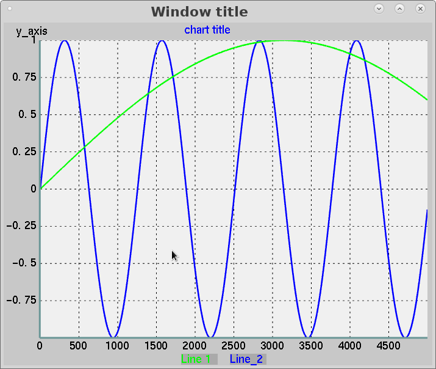
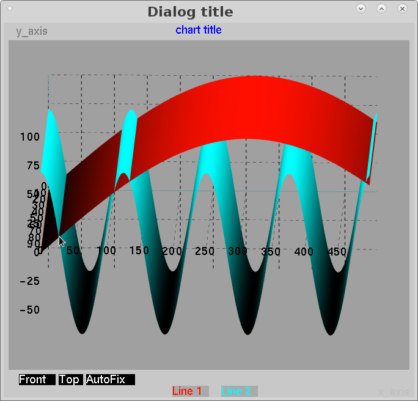

### oglgraph
 Linux oglgraph is a 2D chart visualization library based on OpenGL.
 Could be compile to use QOGLGraph and XOGLGraph, based on Qt and Xwindow dialogs.
 
*whats this*  2D chart  library 
*contains*  2D charts into a Qt5 window and Xwindow
*dependencies*  Qt5/Xlib OpenGL freeglut

2D chart:

3D chart_

